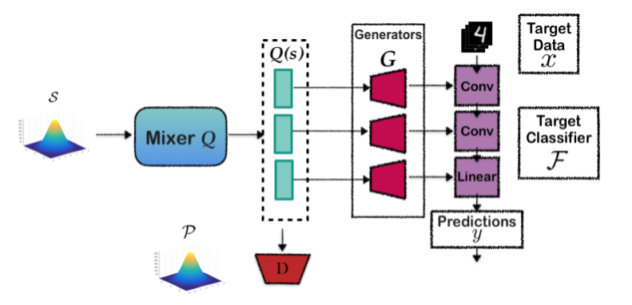

# HyperGAN: A Generative Model for Neural Networks (under construction)


HyperGAN generates fully trained neural networks simply by sampling from noise. 
No large dataset of fully trained examples needed. 
We use repeated MLE estimates to bring the generators closer to generating samples from the true distribution.

In the end, we have fully trained neural networks that can be instantly generated. 
Large ensembles are trivial to create and expand. 

Generating a huge ensemble (100-1000 or more networks) allows us to fully approximate the learned distribution of neural networks. 
Allowing us to make advances in anomaly detection and uncertainty estimation. 

# Train a HyperGAN

## MNIST
``` 
python3 train_hypergan.py --pretrain_e --dataset mnist --cuda
```

## CIFAR-10
```
python3 train_hypergan.py --pretrain_e --dataset cifar --cuda
```

## CIFAR-5 
```
python3 train_hypergan.py --pretrain_e --dataset cifar_hidden --cuda
```
